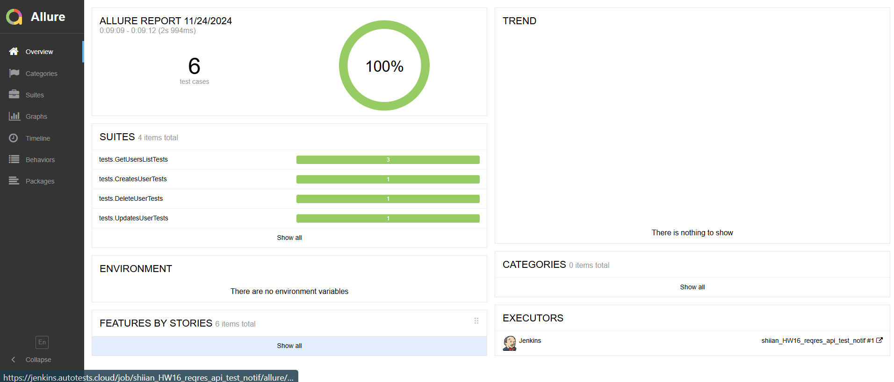
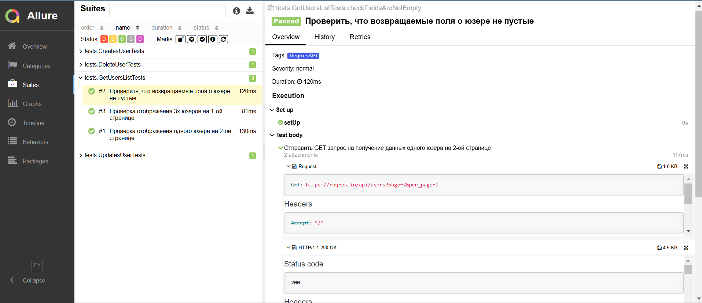
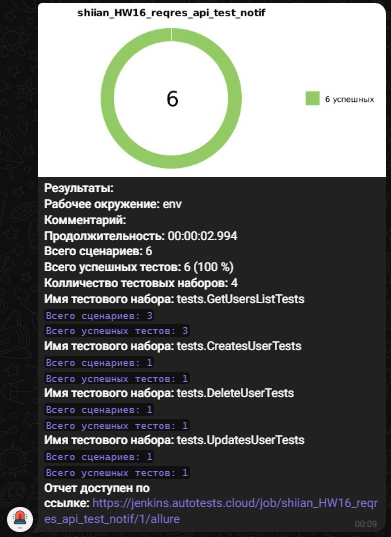

# REST API. Автотесты с REST Assured.

## Задание

**Разработать 5 автотестов на запросы из [https://reqres.in/](https://reqres.in/) с использованием моделей (lombok), спецификаций, allure (со степами) и сборкой в Jenkins.**  

---
# Проект автоматизации тестирования для сайта [ReqRes](https://reqres.in/)

## Содержание
* <a href="#о-проекте">О проекте</a>
* <a href="#основной-функционал">Основной функционал</a>
* <a href="#технологии-и-инструменты">Технологии и инструменты</a>
* <a href="#отчет-о-выполнении-тестов-в-allure-report">Отчет о выполнении тестов в Allure Report</a>
* <a href="#уведомление-о-результатах-тестов-в-telegram">Уведомление о результатах тестов в Telegram</a>

---
## О проекте

Этот проект предназначен для автоматизированного тестирования API сервиса [ReqRes](https://reqres.in/), предоставляющего тестовые данные для демонстрации работы REST API. Тесты разработаны с использованием Java, библиотеки RestAssured, и фреймворка JUnit 5.

Проект создан для проверки корректности работы API, включая такие аспекты, как получение списка пользователей, работа с отдельными пользователями, обновление данных и другие ключевые операции.

---

## Основной функционал 

**GET-запросы**: Проверка получения списка пользователей и отдельного пользователя.

**POST-запросы**: Тестирование создания нового пользователя.

**PUT-запросы**: Обновление информации о пользователе.

**DELETE-запросы**: Удаление пользователя.

**Проверка ответов**: Валидация структуры и содержимого ответов API.

---

## Технологии и инструменты

  
  
  
  
  
  
  
  
  
  

---

## </a> Отчет о выполнении тестов в [Allure Report](https://jenkins.autotests.cloud/job/shiian_HW16_reqres_api_test_notif/3/allure/)

Allure Report — это инструмент для создания подробных и наглядных отчетов о результатах выполнения тестов. В нем отображаются все тестовые шаги, статусы тестов, а также дополнительные детали, такие как время выполнения и возможные ошибки. Allure помогает быстро анализировать результаты тестирования и предоставляет информацию в удобном визуальном формате.

Пример отчета для тестового прогона:

Отчет в Allure включает шаги выполнения тестов, их статус и возможные ошибки, помогая легче отслеживать качество тестируемого приложения.
Шаги выполнения на примере тест-кейса:

   

---

## </a> Уведомление о результатах тестов в Telegram

После завершения тестов бот Telegram автоматически отправляет уведомления с результатами тестового прогона, включая информацию о количестве пройденных и неудавшихся тестов.

